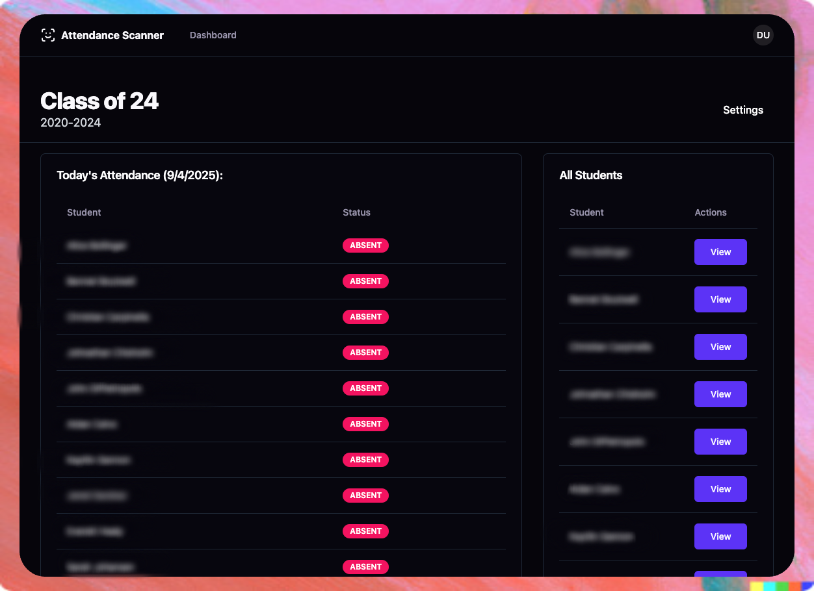

# 📱 Attendance Scanner

> **⚠️ Archived Project (No longer maintained as of April 2024)**
>
> This project was developed for a senior capstone project presented at SkillsUSA Massachusetts for Engineering Design in 2024. While functional, this project does not follow strict security guidelines and packages may be outdated. **Use at your own risk and for reference only.**

A comprehensive attendance tracking system built for educational environments with high student volume. The system consists of a web-based dashboard and a Raspberry Pi-powered barcode scanner that enables quick and efficient student check-ins.

## 🎯 Project Background

This system was created to solve the attendance challenge in a shop setting with approximately 75 students. Traditional paper-based attendance was time-consuming and error-prone, especially in hands-on learning environments.

**Key Achievement**: The entire frontend was developed in under 24 hours, with only minor touchups and bugfixes added afterwards. This demonstrates exceptional rapid prototyping capabilities with modern web technologies.

## 🏗️ Architecture

### Frontend (SvelteKit Web Application)

- **Framework**: SvelteKit with TypeScript
- **UI**: Tailwind CSS + shadcn-svelte components  
- **Authentication**: Lucia Auth with email/password and Google OAuth
- **Database**: PostgreSQL with Drizzle ORM
- **Deployment**: Designed for Vercel with Vercel Postgres

### Backend (Raspberry Pi Scanner)

- **Hardware**: Raspberry Pi with 1.47" OLED display
- **Language**: Python 3
- **Features**: Barcode scanning, WiFi configuration, real-time status display
- **Communication**: REST API calls to web application

## 🚀 Features

### Web Dashboard

- 👥 **Multi-school support** - Manage multiple schools and classes
- 📊 **Real-time attendance tracking** - Live status updates and reports
- 👨‍🎓 **Student management** - Add, edit, and organize student records
- 📧 **Email notifications** - Automated attendance alerts
- 🔐 **Role-based access** - Admin and teacher permissions
- 📱 **Responsive design** - Works on desktop and mobile

### Hardware Scanner

- 📸 **Barcode scanning** - Quick student ID recognition
- 🖥️ **OLED display** - Real-time feedback and status
- 📶 **WiFi management** - Built-in network configuration
- ⚡ **Instant sync** - Immediate attendance recording
- 🔧 **Remote configuration** - API-based settings management

## 📸 Screenshots

### Web Dashboard Interface

| Feature | Screenshot | Description |
|---------|------------|-------------|
| **Login System** |  | Email/password authentication with optional Google OAuth |
| **Profile Management** |  | View and update user profile details |
| **Student Creation** |  | Fast student onboarding form |
| **Student Management** |  | Centralized editing of student records |
| **Class Creation** |  | Class setup |
| **Class Management** |  | Real-time class attendance tracking and student management |
| **Dashboard Overview** |  | Comprehensive overview of all schools that you have access to |
| **School Administration** |  | Multi-class administration with organizational hierarchy |
| **Student Records** |  | View individual student profiles and attendance history |

### Hardware Scanner Design

| Component | Image | Description |
|-----------|-------|-------------|
| **Enclosure Front** |  | Wall-mounted scanner enclosure front view with integrated display |
| **Enclosure Back** |  | Internal component layout and cable management |
| **Internal Layout** |  | Back Panel with additional space for cable management |
| **Mounting Plate** |  | External mounting plate design for secure wall installation |

### 3D Model Files

The hardware enclosure was designed from scratch using CAD software. The complete design files are available in the `assets/3d-models/` directory:

- **Back Plate.f3d** - Fusion 360 design file for the mounting plate
- **Enclosure V2.f3z** - Complete enclosure assembly with all components

These models were designed to house the Raspberry Pi and 1.47" OLED display while maintaining a clean, professional appearance suitable for classroom environments.

## 🛠️ Technical Stack

### Frontend Dependencies

- **Core**: SvelteKit, TypeScript, Vite
- **UI/UX**: Tailwind CSS, shadcn-svelte, Lucide icons
- **Auth**: Lucia, Arctic (OAuth)
- **Database**: Drizzle ORM, PostgreSQL
- **Forms**: Superforms, Zod validation
- **Email**: AWS SES, Nodemailer

### Backend Dependencies  

- **Core**: Python 3, asyncio
- **Hardware**: spidev (SPI), Pillow (imaging)
- **Network**: requests, python-dotenv
- **Display**: Custom LCD driver library

## ⚙️ Installation & Setup

### Prerequisites

- Node.js 18+ and pnpm
- PostgreSQL database
- Raspberry Pi (for scanner hardware)

### Frontend Setup

1. **Clone and install**

   ```bash
   git clone https://github.com/adamsanclemente/AttendanceScanner.git
   cd AttendanceScanner/app
   pnpm install
   ```

2. **Environment configuration**

   ```bash
   cp sample.env .env
   # Edit .env with your database and API credentials
   ```

3. **Database setup**

   ```bash
   pnpm run generate  # Generate database schema
   pnpm run migrate   # Apply migrations
   ```

4. **Development server**

   ```bash
   pnpm run dev
   ```

### Scanner Setup (Raspberry Pi)

1. **Install dependencies**

   ```bash
   cd backend
   pip install -r requirements.txt
   ```

2. **Configure environment**

   ```bash
   cp .env.example .env
   # Set API_BASE_URL and API_KEY
   ```

3. **Run scanner application**

   ```bash
   python main.py
   ```

## 🔒 Security Considerations

This project was developed as a proof-of-concept for educational purposes. Several security improvements would be needed for production use:

- ✅ API key authentication (implemented)
- ❌ Rate limiting
- ❌ Input sanitization
- ❌ HTTPS enforcement
- ❌ Database connection encryption
- ❌ Audit logging

## 🎓 Educational Value

This project demonstrates:

- **Full-stack development** with modern JavaScript frameworks
- **Hardware integration** with web applications  
- **Database design** for educational management systems
- **Real-time communication** between devices
- **Rapid prototyping** techniques and time-constrained frontend development
- **3D modeling and CAD design** for custom hardware enclosures
- **Complete web application** from concept to deployment in 24 hours
- **Frontend engineering** under tight time constraints

## 📄 License

MIT License - See LICENSE file for details

## 👨‍💻 Author

Adam San Clemente

- GitHub: [@adamsanclemente](https://github.com/adamsanclemente)
- LinkedIn: [adam-san-clemente](https://linkedin.com/in/adam-san-clemente)

---

*This project showcases skills learned during professional development and demonstrates rapid application development capabilities.*
